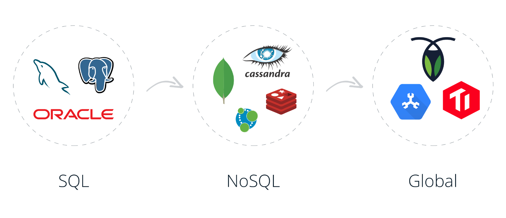

# Algorithm-pdf

## Introduction

I collect these awesome materials here to review them from time to time.
I think it will be helpful to those who share the same interests as me.

From [whosly/Database-pdf](https://gitee.com/whosly/Database-pdf)

# Awesome Database Development

Database development is interesting and challenging.
You can always find interesting things to learn and challenging problems to solve.
You need to know a lot of things and get them right to build a reliable and high-performance database.
And it takes time, a lot of time, to think and practice.   [Database](md/Database/README.md)

# Linux kernel

# About

## Copyright & More | 延伸阅读

笔者所有文章遵循
[知识共享 署名-非商业性使用-禁止演绎 4.0 国际许可协议](https://creativecommons.org/licenses/by-nc-nd/4.0/deed.zh)。
