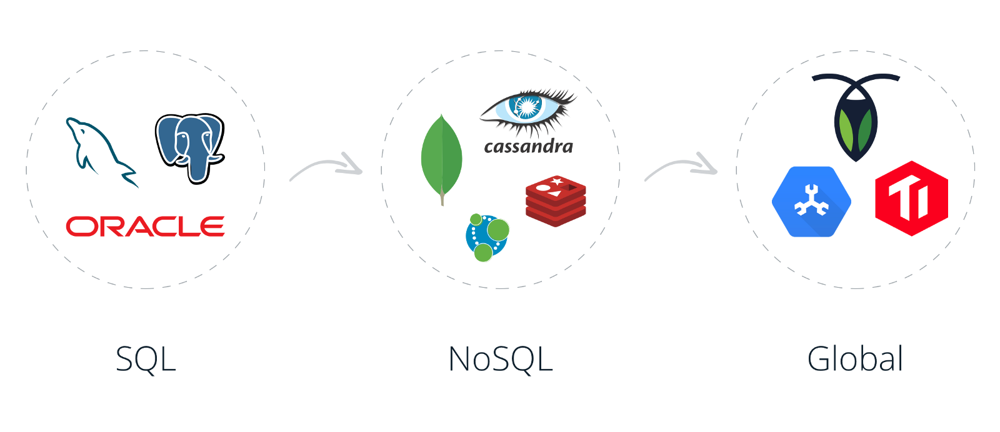

# Algorithm-pdf

## Introduction

I collect these awesome materials here to review them from time to time.
I think it will be helpful to those who share the same interests as me.

From [whosly/database-pdfs](https://gitee.com/whosly/database-pdfs)

 

# Awesome Database Development

Database development is interesting and challenging.
You can always find interesting things to learn and challenging problems to solve.
You need to know a lot of things and get them right to build a reliable and high-performance database.
And it takes time, a lot of time, to think and practice.   [Database](../md/en-us/Database/README.md)

# Linux kernel
