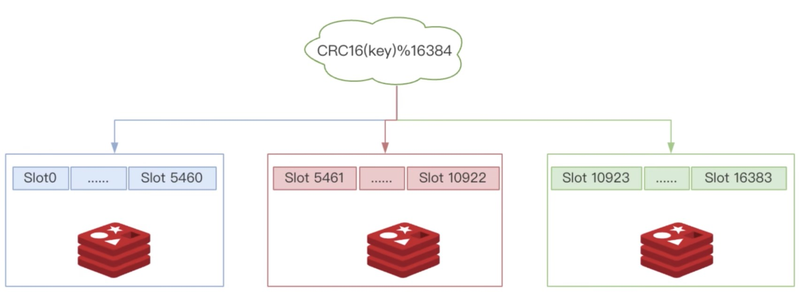

Redis 是完全开源免费的，遵守 BSD 协议，是一个高性能的 key - value 数据库。

Redis 与 其他 key - value 缓存产品有以下三个特点：
* Redis 支持数据持久化，可以将内存中的数据保存在磁盘中，重启的时候可以再次加载进行使用。
* Redis 不仅仅支持简单的 key - value 类型的数据，同时还提供 list，set，zset，hash 等数据结构的存储
* Redis 支持数据的备份，即 master - slave 模式的数据备份

## Why is Redis so fast

- Redis 是一个基于 RAM 的数据库。RAM 访问比随机磁盘访问至少快 1000 倍。
- Redis 利用 IO 复用和单线程执行循环来提高执行效率。
- Redis 利用了几个高效的底层数据结构。

## 为什么 Redis cluster要设计 16384 个槽
Redis Cluster 采用数据分片机制，定义了 16384个 Slot槽位，集群中的每个Redis 实例负责维护一部分槽以及槽所映射的键值数据。

对于客户端请求的key，根据公式 `HASH_SLOT = CRC16(key) mod 16384`，计算出映射到哪个分片上，然后Redis会去相应的节点进行操作！

然而，CRC16算法产生的hash值有16bit，该算法可以产生2^16-=65536个值。 换句话说，值是分布在0~65535之间。
那在做mod运算的时候，为什么不mod 65536，而选择mod 16384？

这个问题，作者给出了回答， 地址如下: https://github.com/antirez/redis/issues/2576。

The reason is:

* Normal heartbeat packets carry the full configuration of a node, that can be replaced in an idempotent way with the old in order to update an old config. 
This means they contain the slots configuration for a node, in raw form, that uses 2k of space with16k slots, but would use a prohibitive 8k of space using 65k slots.
* At the same time it is unlikely that Redis Cluster would scale to more than 1000 mater nodes because of other design tradeoffs.

So 16k was in the right range to ensure enough slots per master with a max of 1000 maters, but a small enough number to propagate the slot configuration as a raw bitmap easily. Note that in small clusters the bitmap would be hard to compress because when N is small the bitmap would have slots/N bits set that is a large percentage of bits set.
