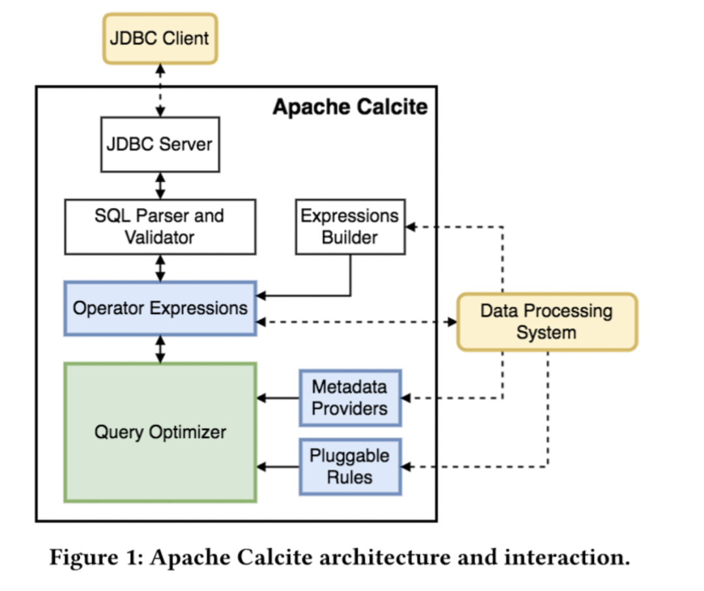
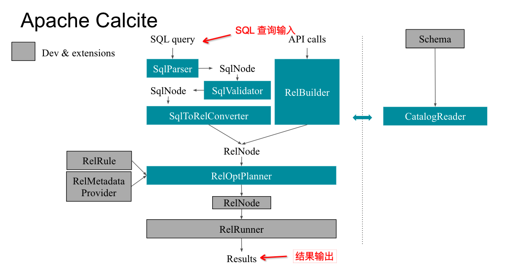
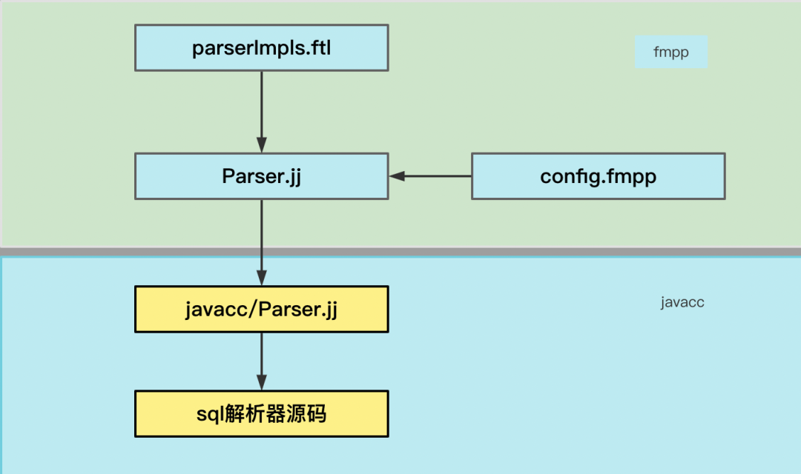

# Calcite 介绍
Apache Calcite 是一个动态的数据管理框架，其中包含了许多组件，例如 SQL 解析器、SQL 验证器、SQL 优化器、SQL 生成器等。
本身不涉及任何物理存储信息，而是专注在 SQL 解析、基于关系代数的查询优化，
通过扩展方式来对接底层存储。

因为 Calcite 的体系结构并不支持数据的存储和处理，所以 Calcite 天然具备了在多种计算引擎和存储格式之间作为“中介者”的能力。

目前 Apache Calcite 被应用在广泛的数据开源系统中，
比如 Apache Hive、Apache Phoenix、Apache Flink 等。

Apache Calcite 整体是按模块化进行设计，各个模块支持可扩展，
比如 SQL 语法文件、元数据、Transformation Rule（逻辑转换规则）和 
Implementation Rule（物理转换规则）、CBO 元数据获取的 Metadata Handler、
自定义 RelNode 和 SqlNode 类型等等，同时 Calcite 底层也支持不同引擎的 SQL 方言转换。

对于 SQL Planner 的优化框架，整体上 Calcite 已经搭建完成，我们可以直接自定义扩展所需要的差异化特性。

## 各模块说明
### JDBC Client、 JDBC Server
主要负责一个 SQL 的请求响应和结果返回，可以基于 Calcite 子项目 Avatica 框架来进行实现。

### SQL Parser、 Validator
Parser 主要负责对一个 SQL 进行解析，生成 AST 树。Validator 主要是验证 SQL 的元数据合法性。

### Operator Expressions
将一棵 AST Tree 转换为 RelNode 关系代数的计划树，这样优化器才能识别和优化。

### Query Optimizer 
Calcite 优化器模块，有 RBO 和 CBO 优化器，即对 Query 的关系代数计划树做优化。

### Metadata Providers
CBO 优化器计算 Cost 时所需元数据的提供者，包括：Selectivity（选择率）、RowCount、DistinctRowCount 等等。

### Pluggable Rules
Calcite 优化规则模块，Calcite 主要有：Transformation Rule（逻辑优化规则）和 ConverterRule（Implementation Rule），用户可以自定义可扩展。

## 调用流转逻辑
一个 SQL 的处理逻辑，会使用 SqlParser  将 SQL 解析为 SqlNode，
使用 SqlValidator 来进行 SQL 校验，使用 SqlToRelConverter 来将 SqlNode 转换为 RelNode 关系代数，
使用 RelOptPlanner（具体有 HepPlanner  和 VolcanoPlanner ）来进行计划优化，
同时可以通过扩展 RelOptRule 、BuiltInMetadata 的实现，来自定义 SQL 优化器的逻辑。

下图是 Calcite 底层核心代码调用流转示意图：

# Calcite 组成
Calcite 提供了 ANSI 标准 SQL 的解析，以及各种 SQL 方言，针对来自于不同数据源的复杂 SQL，
在 Calcite 中会把 SQL 解析成SqlNode语法树结构，然后根据得到的语法树转换成自定义 Node，
通过自定义 Node 解析获取到表的字段信息、以及表信息、血缘等相关信息。

# Calcite SQL 语法解析
Calcite 使用 javacc 作为语法解析器，freemaker 作为模版，
把 parserImpls.ftl、config.fmpp、Parser.jj 模版合成最终的语法词法文件，最终通过 javacc 编译成自定义的解析器源码

## Parser.jj
Parser.jj 是一个 Calcite 核心的语法和词法文件，基于 Apache FreeMaker 模版，该模版包含着变量，这些变量在编译时可以被替换。

## parserImpl.ftl
提供自定义 SQL 语句、literals、dataType 的实现方法

## config.fmpp
该文件是 FMPP 的配置文件，提供了 SQL 语句、literals、dataType 的接口扩展入口

语法解析整体流程如下图所示：

