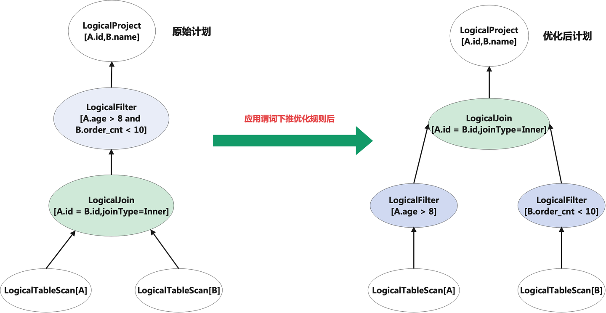
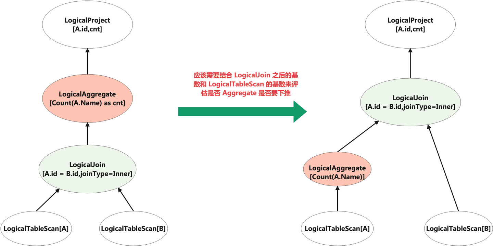
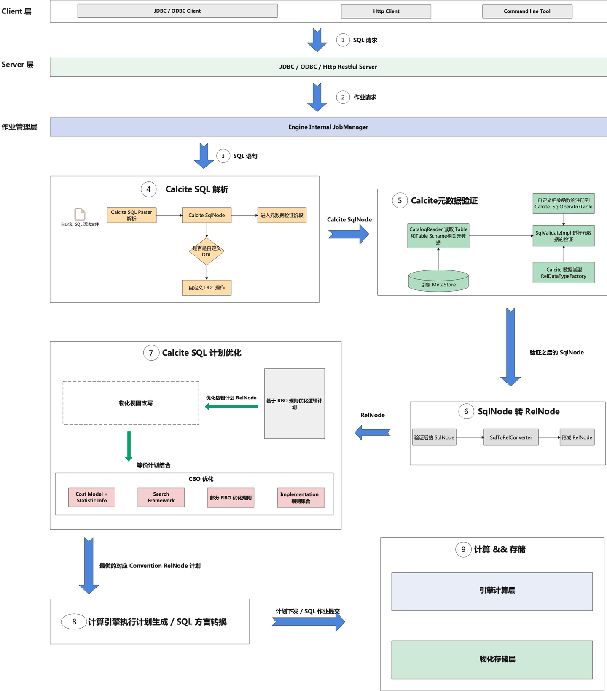

# Calcite SQL 查询优化器的优化方式
常见的 SQL 优化方式有两种：RBO 优化（基于先验经验的启发式规则优化）和 CBO 优化（基于计算成本的优化）。

RBO 主要是使用一些预定义的先验且有收益的优化规则集合，来对 SQL 进行优化，
常见的有：常量折叠、谓词下推、列裁剪、关联子查询消除等优化规则。

## RBO
以谓词下推优化举例：

上图左边是原始 SQL 计划，可以看到，通过 Filter 谓词下推规则优化后，
Filter 节点已经下推到了 Join 节点之下，这样能够提前对 Scan 节点的数据进行过滤，
最终减少进入到 Join 算子的数据量，减少 Join 节点的计算成本。

## CBO
当然，根据先验经验主义的优化方式也存在缺陷，比如在部分场景中，
由于没有考虑到 SQL 在真实环境下的实际运行情况，其执行效率可能并不是最优的，
所以就有了基于 Cost 的优化方式（CBO）。

CBO 优化，则是在期望的物理特质下，通过对不同物理计划运行所需要的成本进行估算，
使用动态规划，来选择一个计算成本最优的物理计划。
一般 Cost 包括：CPU、内存、磁盘 IO、网络 IO 等等。

以 Group By（聚合） 下推举例：

在上图中，如果 LogicalJoin 之后的基数（输出的行数）如果比 LogicalTableScan[A] 后的基数要小的话，
Aggregate 不下推，其实会比下推更加节约资源。但完全进入 CBO 阶段，
如果计划搜索空间过大的话，CBO 找出最优计划的耗时可能又很久。

所以在使用 RBO 优化规则时，某些规则可以比较计划转换前后的 Cost ，来决定是否应用该规则。

目前业界像 Oracle 和 MemSQL（SingStoreDB）在它们的优化器都已经按照这种方式进行实现。

# SQL 查询优化器的框架类型
目前业界的 SQL 优化器框架类型有：Volcano、Cascades、Columbia、Orca 等优化器框架，
比较主流的优化器框架为 Cascades，像微软的 SQL Server、阿里 ADB、PingCAP 的 TIDB、
CockroachDB、StarRocks 这些商业化产品，
其 SQL 优化器都是基于 Cascades 优化器框架的。

Columbia、Orca 这两款优化器框架都是在 Cascades 优化器基础上，做了部分改良和优化。

以 Columbia 优化器框架举例，其在 Cascades 优化器基础上，对于搜索计划空间剪枝做得更好，
不仅能够基于 Group 空间计划剪枝，同时也能够做全局计划剪枝，
这样在一个可以接收并近似最优计划的前提下，通过剪枝来减少 Plan 空间搜索的时间，
提升查询性能。Orca 则是能够作为独立的优化器在数据库系统之外运行，
这样的好处在于优化器不需要和数据库系统紧密耦合在一起，
但需要提供一种能够和数据库系统之间的交互通信机制来处理查询。

Cascades 优化器相对于 Volcano 优化器最大的区别在于：
Volcano 优化器会先尽可能枚举所有的执行计划空间，然后再从中找出最优的执行计划。

而 Cascades 优化器能够在搜索过程中，对空间搜索计划进行剪枝，
使得搜索的执行计划空间不会像 Vocano 那么大，但也可以获得一个相对较好的执行计划，
这样通过减少空间计划的搜索时间，
来降低 SQL Planning 的耗时，从而提升查询性能。

# 一条 SQL 在 Apache Calcite 的优化旅程
在一个典型的 SQL 查询服务中，从用户输入一条 SQL 语句开始，到最终结果返回到 Client，
一般会经过：Client 端 SQL 查询请求、服务端接收到 SQL 请求和内部作业构建、
SQL 解析、SQL 校验、SQL 优化，继而形成物理计划。

如果底层有自己的计算引擎，还可以将物理计划转换为执行计划，下发到计算节点并执行；
如果底层计算引擎是其他引擎的话，
可以将物理计划翻译成对应引擎的 SQL 方言，然后提交到对应引擎执行。

我们通过一个流程图，来展开介绍一条 SQL 在 Apache Calcite 是如何完成解析、优化与改写的。

如上图所示，一条 SQL 整体处理流程分为以下几个步骤：

1、当 Client 层发起一条 SQL 请求时，请求会到 JDBC Server 端，JDBC Server 端底层一般可以是 GRPC 服务或者 HTTP 服务，在 Calcite 中，也可以使用 Calcite Avatica 来做 JDBC 服务端和 Driver 层的代码开发。

2、服务端接收到 SQL 请求后，会在内部构建出一个 Job 作业请求，同时提交到内部作业服务，之后会进入到 SQL 链路处理流程中。

3、在 SQL 处理流程中，第一步则是将 SQL 解析成一棵 SqlNode 的 AST 抽象语法树，这个过程中会做 SQL 词法和语法的校验。之后会进入到 SQL 验证阶段，SQL 验证阶段主要对 SQL 的语义进行验证，比如查询的数据表是否存在、函数是否存在、函数参数数据类型是否匹配等等。元数据验证完之后，其输出本质还是一棵 SqlNode Tree，接下来会将 SqlNode Tree 转换为一棵 RelNode 关系代数 Tree，同时进入到 SQL 优化阶段。

4、在 Calcite 中，RBO 优化主要使用 HepPlanner 类来进行实现。CBO 优化，则是使用 VolcanoPlanner 来进行实现，RBO 规则和 CBO 规则都支持自定义扩展。

5、经过 SQL 优化器的优化，会产出最优的物理计划。但此时仍然无法最终运行，我们还需要将物理计划转化为底层计算引擎的 SQL 方言，才能进行作业的提交和计算。

