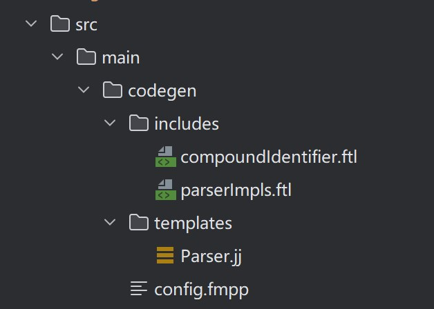

# 解析器原理

# Calcite SQL 解析器
Calcite 默认使用 JavaCC 生成 SQL 解析器，可以很方便的将其替换为 Antlr 作为代码生成器 。
JavaCC 全称 Java Compiler Compiler，是一个开源的 Java 程序解析器生成器，生成的语法分析器采用递归下降语法解析，简
称 LL(K)。主要通过一些模版文件生成语法解析程序（例如根据 .jj 文件或者 .jjt 等文件生产代码）。

Calcite 的解析体系是将 SQL 解析成抽象语法树， Calcite 中使用 SqlNode 这种数据结构表示语法树上的每个节点，
例如 "select 1 + 1 = 2" 会将其拆分为多个 SqlNode。

SqlNode 有几个重要的封装子类，SqlLiteral、SqlIdentifier 和 SqlCall。 
* SqlLiteral：封装常量，也叫字面量。
* SqlIdentifier：SQL 标识符，例如表名、字段名等。
* SqlCall：表示一种操作，SqlSelect、SqlAlter、SqlDDL 等都继承 SqlCall。

# SQL Parser
Calcite 提供了一个默认的 SQL 语法解析器，默认支持的语法查看此[文档](https://calcite.apache.org/docs/reference.html)。

除了默认语法外，Calcite 还提供了其他 SQL 语法的兼容，例如 STRICT_92、STRICT_99、STRICT_2003、MYSQL_5、ORACLE_12 等。

## 扩展语法
业务场景复杂多变，Calcite 解析器并不能满足我们的所有场景的需求。因此需要自定义的扩展SQL 语法。怎么扩展呢？

一般采用模版引擎来扩展 SQL 语法。这样既侵入性更小。使用 FreeMarker 模版引擎扩展语法的示例见<[whosly/calcite-jj](https://gitee.com/whosly/calcite-jj)>。

通过模版引擎扩展 SQL 语法的相关目录结构如下图所示：

其中，
templates 文件夹下的 Parser.jj 作为模版，
includes 目录下是扩展语法文件，
config.fmpp 作为整体的配置，包含定义解析器类名、导入扩展语法文件和自定义关键字等。

所以实现自定义 SQL Parser 的步骤为：
* 获取 Calcite 源码中的 Parser.jj 文件，将此文件作为模版用于后续扩展。
* 编写自定义 SQL 扩展语法文件和配置文件。
* 使用 JavaCC 编译。
* 验证

