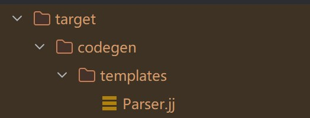

# 如何基于 Calcite 实现一个简单的 SQL 解析器并扩展其语法

## 获取 Calcite 源码中的 Parser.jj 文件
使用 Maven 插件 maven-dependency-plugin 直接从 Calcite 源码包中进行拷贝，
将 Parser.jj 文件拷贝到项目构建目录下。

源码： [load-parser-jj](https://gitee.com/whosly/calcite-jj/tree/master/load-parser-jj)

```pom
<plugin>
    <groupId>org.apache.maven.plugins</groupId>
    <artifactId>maven-dependency-plugin</artifactId>
    <executions>
        <execution>
            <id>unpack-parser-template</id>
            <phase>initialize</phase>
            <goals>
                <goal>unpack</goal>
            </goals>
            <configuration>
                <artifactItems>
                    <artifactItem>
                        <groupId>org.apache.calcite</groupId>
                        <artifactId>calcite-core</artifactId>
                        <version>1.31.0</version>
                        <type>jar</type>
                        <overWrite>true</overWrite>
                        <outputDirectory>${project.build.directory}/</outputDirectory>
                        <includes>**/Parser.jj</includes>
                    </artifactItem>
                </artifactItems>
                <skip>false</skip>
            </configuration>
        </execution>
    </executions>
</plugin>
```

可以使用 mvn initialize 进行命令测试，
如果成功会在 target 目录下找到拷贝的语法模版文件。




## 自定义 SQL 语法
