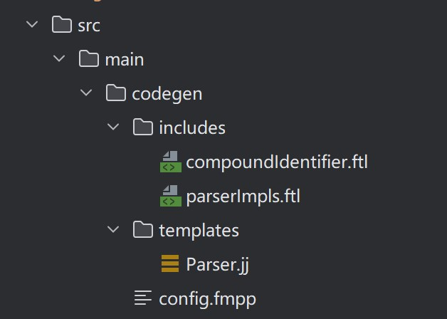

# 如何基于 Calcite 实现一个简单的 SQL 解析器并扩展其语法

# 插件介绍
## FreeMarker 插件
使用 FreeMarker 模版插件，根据 config.fmpp 生成 parser.jj 文件。

Maven 配置中 `<cfgFile>` 表示 config.fmpp 文件路径。
`<outputDirectory>` 表示输出路径。`<templateDirectory>` 表示从 Calcite 拷贝的模版文件路径。

配置源码：

```
<plugin>
    <groupId>com.googlecode.fmpp-maven-plugin</groupId>
    <artifactId>fmpp-maven-plugin</artifactId>
    <version>1.0</version>
    <configuration>
        <cfgFile>src/main/codegen/config.fmpp</cfgFile>
        <outputDirectory>${project.build.directory}/generated-sources/fmpp</outputDirectory>
        <templateDirectory>src/main/codegen/templates</templateDirectory>
    </configuration>
    <dependencies>
        <dependency>
            <groupId>org.freemarker</groupId>
            <artifactId>freemarker</artifactId>
            <version>2.3.28</version>
        </dependency>
    </dependencies>
    <executions>
        <execution>
            <id>generate-fmpp-sources</id>
            <phase>generate-sources</phase>
            <goals>
                <goal>generate</goal>
            </goals>
        </execution>
    </executions>
</plugin>
```

## JavaCC 插件
使用 JavaCC 编译插件，根据 parser.jj 文件生成最终的解析器代码。

`<sourceDirectory>` 为 FreeMarker 生成的模版文件路径。
后续再次执行 mvn generate-resources 命令，在 `<outputDirectory>` 标签配置的路径下会生成解析器相关的类。

配置源码：

```
<!-- generate the parser (Parser.jj is itself generated wit fmpp above) -->
<plugin> 
    <groupId>org.codehaus.mojo</groupId>
    <artifactId>javacc-maven-plugin</artifactId>
    <version>3.1.0</version>
    <executions>
        <execution>
            <id>javacc</id>
            <goals>
                <goal>javacc</goal>
            </goals>
            <configuration>
                <sourceDirectory>${project.build.directory}/generated-sources/fmpp</sourceDirectory>
                <includes>
                    <include>**/*.jj</include>
                </includes>
                <lookAhead>1</lookAhead>
                <isStatic>false</isStatic>
                <outputDirectory>${project.build.directory}/generated-sources/javacc</outputDirectory>
            </configuration>
            <phase>generate-sources</phase>
        </execution>
        <execution>
            <id>javacc-test</id>
            <phase>generate-test-sources</phase>
            <goals>
                <goal>javacc</goal>
            </goals>
            <configuration>
                <sourceDirectory>${project.build.directory}/generated-test-sources/fmpp</sourceDirectory>
                <outputDirectory>${project.build.directory}/generated-test-sources/javacc</outputDirectory>
                <includes>
                    <include>**/Parser.jj</include>
                </includes>
                <lookAhead>2</lookAhead>
                <isStatic>false</isStatic>
                <ignoreCase>true</ignoreCase>
                <unicodeInput>true</unicodeInput>
            </configuration>
        </execution>
    </executions>
</plugin>
```

## maven-dependency 插件
使用 Maven 插件 maven-dependency-plugin ， 可以直接从 Calcite 源码包中进行拷贝，将 Parser.jj 文件拷贝到项目构建目录下。

该插件只是避免了去翻 calcite-core 源代码。此处忽略。


# 获取 Calcite 源码中的 Parser.jj 文件
从 Calcite 源码包中将 Parser.jj 文件拷贝到项目构建目录下。

源码实践，仅供参考： [load-parser-jj](https://gitee.com/whosly/calcite-jj/tree/master/load-parser-jj)

```pom
<plugin>
    <groupId>org.apache.maven.plugins</groupId>
    <artifactId>maven-dependency-plugin</artifactId>
    <version>3.7.1</version>
    <executions>
        <execution>
            <id>unpack-parser-template</id>
            <phase>initialize</phase>
            <goals>
                <goal>unpack</goal>
            </goals>
            <configuration>
                <artifactItems>
                    <artifactItem>
                        <groupId>org.apache.calcite</groupId>
                        <artifactId>calcite-core</artifactId>
                        <version>${calcite.version}</version>
                        <type>jar</type>
                        <overWrite>true</overWrite>
                        <outputDirectory>${project.build.directory}/</outputDirectory>
                        <includes>**/Parser.jj</includes>
                    </artifactItem>
                </artifactItems>
                <skip>false</skip>
            </configuration>
        </execution>
    </executions>
</plugin>
```

可以使用 mvn initialize 进行命令测试，
如果成功会在 target 目录下找到拷贝的语法模版文件。


## 自定义 SQL 语法
### 复制模板文件
从calcite源码包中，将code\src\main\codegen下所有文件复制到自己的代码路径下。包含 config.fmpp、templates/Parser.jj（模板文件）。

复制后，目录结构如下：




### 合并 config.fmpp
把 default_config.fmpp 中的parser属性与config.fmpp中的parser属性合并。

源码中， config.fmpp 代码为：
```
data: {
  # Data declarations for this parser.
  #
  # Default declarations are in default_config.fmpp; if you do not include a
  # declaration ('imports' or 'nonReservedKeywords', for example) in this file,
  # FMPP will use the declaration from default_config.fmpp.
  parser: {
    # Generated parser implementation package and class name.
    package: "org.apache.calcite.sql.parser.impl",
    class: "SqlParserImpl",

    # List of files in @includes directory that have parser method
    # implementations for parsing custom SQL statements, literals or types
    # given as part of "statementParserMethods", "literalParserMethods" or
    # "dataTypeParserMethods".
    implementationFiles: [
      "parserImpls.ftl"
    ]
  }
}

freemarkerLinks: {
  includes: includes/
}
```

源码中， default_config.fmpp 代码为：
```
# Default data declarations for parsers.
# Each of these may be overridden in a parser's config.fmpp file.
# In addition, each parser must define "package" and "class".
parser: {
  # List of additional classes and packages to import.
  # Example: "org.apache.calcite.sql.*", "java.util.List".
  imports: [
  ]

  # List of new keywords. Example: "DATABASES", "TABLES". If the keyword is
  # not a reserved keyword, add it to the 'nonReservedKeywords' section.
  keywords: [
  ]

  # List of keywords from "keywords" section that are not reserved.
  nonReservedKeywords: [
    "A"
    "ABSENT"
    "ABSOLUTE"
    "ACTION"
    "ADA"
    "ADD"
    "ADMIN"
    "AFTER"
    "ALWAYS"
    "APPLY"
    "ARRAY_AGG"
    "ARRAY_CONCAT_AGG"
    "ASC"
    "ASSERTION"
    "ASSIGNMENT"
    "ATTRIBUTE"
    "ATTRIBUTES"
    "BEFORE"
    "BERNOULLI"
    "BREADTH"
    "C"
    "CASCADE"
    "CATALOG"
    "CATALOG_NAME"
    "CENTURY"
    "CHAIN"
    "CHARACTERISTICS"
    "CHARACTERS"
    "CHARACTER_SET_CATALOG"
    "CHARACTER_SET_NAME"
    "CHARACTER_SET_SCHEMA"
    "CLASS_ORIGIN"
    "COBOL"
    "COLLATION"
    "COLLATION_CATALOG"
    "COLLATION_NAME"
    "COLLATION_SCHEMA"
    "COLUMN_NAME"
    "COMMAND_FUNCTION"
    "COMMAND_FUNCTION_CODE"
    "COMMITTED"
    "CONDITIONAL"
    "CONDITION_NUMBER"
    "CONNECTION"
    "CONNECTION_NAME"
    "CONSTRAINT_CATALOG"
    "CONSTRAINT_NAME"
    "CONSTRAINTS"
    "CONSTRAINT_SCHEMA"
    "CONSTRUCTOR"
    "CONTINUE"
    "CURSOR_NAME"
    "DATA"
    "DATABASE"
    "DATE_DIFF"
    "DATE_TRUNC"
    "DATETIME_DIFF"
    "DATETIME_INTERVAL_CODE"
    "DATETIME_INTERVAL_PRECISION"
    "DATETIME_TRUNC"
    "DAYOFWEEK"
    "DAYOFYEAR"
    "DAYS"
    "DECADE"
    "DEFAULTS"
    "DEFERRABLE"
    "DEFERRED"
    "DEFINED"
    "DEFINER"
    "DEGREE"
    "DEPTH"
    "DERIVED"
    "DESC"
    "DESCRIPTION"
    "DESCRIPTOR"
    "DIAGNOSTICS"
    "DISPATCH"
    "DOMAIN"
    "DOW"
    "DOY"
    "DOT_FORMAT"
    "DYNAMIC_FUNCTION"
    "DYNAMIC_FUNCTION_CODE"
    "ENCODING"
    "EPOCH"
    "ERROR"
    "EXCEPTION"
    "EXCLUDE"
    "EXCLUDING"
    "FINAL"
    "FIRST"
    "FOLLOWING"
    "FORMAT"
    "FORTRAN"
    "FOUND"
    "FRAC_SECOND"
    "G"
    "GENERAL"
    "GENERATED"
    "GEOMETRY"
    "GO"
    "GOTO"
    "GRANTED"
    "GROUP_CONCAT"
    "HIERARCHY"
    "HOP"
    "HOURS"
    "IGNORE"
    "ILIKE"
    "IMMEDIATE"
    "IMMEDIATELY"
    "IMPLEMENTATION"
    "INCLUDE"
    "INCLUDING"
    "INCREMENT"
    "INITIALLY"
    "INPUT"
    "INSTANCE"
    "INSTANTIABLE"
    "INVOKER"
    "ISODOW"
    "ISOLATION"
    "ISOYEAR"
    "JAVA"
    "JSON"
    "K"
    "KEY"
    "KEY_MEMBER"
    "KEY_TYPE"
    "LABEL"
    "LAST"
    "LENGTH"
    "LEVEL"
    "LIBRARY"
    "LOCATOR"
    "M"
    "MAP"
    "MATCHED"
    "MAXVALUE"
    "MESSAGE_LENGTH"
    "MESSAGE_OCTET_LENGTH"
    "MESSAGE_TEXT"
    "MICROSECOND"
    "MILLENNIUM"
    "MILLISECOND"
    "MINUTES"
    "MINVALUE"
    "MONTHS"
    "MORE_"
    "MUMPS"
    "NAME"
    "NAMES"
    "NANOSECOND"
    "NESTING"
    "NORMALIZED"
    "NULLABLE"
    "NULLS"
    "NUMBER"
    "OBJECT"
    "OCTETS"
    "OPTION"
    "OPTIONS"
    "ORDERING"
    "ORDINALITY"
    "OTHERS"
    "OUTPUT"
    "OVERRIDING"
    "PAD"
    "PARAMETER_MODE"
    "PARAMETER_NAME"
    "PARAMETER_ORDINAL_POSITION"
    "PARAMETER_SPECIFIC_CATALOG"
    "PARAMETER_SPECIFIC_NAME"
    "PARAMETER_SPECIFIC_SCHEMA"
    "PARTIAL"
    "PASCAL"
    "PASSING"
    "PASSTHROUGH"
    "PAST"
    "PATH"
    "PERCENTILE_CONT"
    "PERCENTILE_DISC"
    "PIVOT"
    "PLACING"
    "PLAN"
    "PLI"
    "PRECEDING"
    "PRESERVE"
    "PRIOR"
    "PRIVILEGES"
    "PUBLIC"
    "QUARTER"
    "QUARTERS"
    "READ"
    "RELATIVE"
    "REPEATABLE"
    "REPLACE"
    "RESPECT"
    "RESTART"
    "RESTRICT"
    "RETURNED_CARDINALITY"
    "RETURNED_LENGTH"
    "RETURNED_OCTET_LENGTH"
    "RETURNED_SQLSTATE"
    "RETURNING"
    "RLIKE"
    "ROLE"
    "ROUTINE"
    "ROUTINE_CATALOG"
    "ROUTINE_NAME"
    "ROUTINE_SCHEMA"
    "ROW_COUNT"
    "SCALAR"
    "SCALE"
    "SCHEMA"
    "SCHEMA_NAME"
    "SCOPE_CATALOGS"
    "SCOPE_NAME"
    "SCOPE_SCHEMA"
    "SECONDS"
    "SECTION"
    "SECURITY"
    "SELF"
    "SEPARATOR"
    "SEQUENCE"
    "SERIALIZABLE"
    "SERVER"
    "SERVER_NAME"
    "SESSION"
    "SETS"
    "SIMPLE"
    "SIZE"
    "SOURCE"
    "SPACE"
    "SPECIFIC_NAME"
    "SQL_BIGINT"
    "SQL_BINARY"
    "SQL_BIT"
    "SQL_BLOB"
    "SQL_BOOLEAN"
    "SQL_CHAR"
    "SQL_CLOB"
    "SQL_DATE"
    "SQL_DECIMAL"
    "SQL_DOUBLE"
    "SQL_FLOAT"
    "SQL_INTEGER"
    "SQL_INTERVAL_DAY"
    "SQL_INTERVAL_DAY_TO_HOUR"
    "SQL_INTERVAL_DAY_TO_MINUTE"
    "SQL_INTERVAL_DAY_TO_SECOND"
    "SQL_INTERVAL_HOUR"
    "SQL_INTERVAL_HOUR_TO_MINUTE"
    "SQL_INTERVAL_HOUR_TO_SECOND"
    "SQL_INTERVAL_MINUTE"
    "SQL_INTERVAL_MINUTE_TO_SECOND"
    "SQL_INTERVAL_MONTH"
    "SQL_INTERVAL_SECOND"
    "SQL_INTERVAL_YEAR"
    "SQL_INTERVAL_YEAR_TO_MONTH"
    "SQL_LONGVARBINARY"
    "SQL_LONGVARCHAR"
    "SQL_LONGVARNCHAR"
    "SQL_NCHAR"
    "SQL_NCLOB"
    "SQL_NUMERIC"
    "SQL_NVARCHAR"
    "SQL_REAL"
    "SQL_SMALLINT"
    "SQL_TIME"
    "SQL_TIMESTAMP"
    "SQL_TINYINT"
    "SQL_TSI_DAY"
    "SQL_TSI_FRAC_SECOND"
    "SQL_TSI_HOUR"
    "SQL_TSI_MICROSECOND"
    "SQL_TSI_MINUTE"
    "SQL_TSI_MONTH"
    "SQL_TSI_QUARTER"
    "SQL_TSI_SECOND"
    "SQL_TSI_WEEK"
    "SQL_TSI_YEAR"
    "SQL_VARBINARY"
    "SQL_VARCHAR"
    "STATE"
    "STATEMENT"
    "STRING_AGG"
    "STRUCTURE"
    "STYLE"
    "SUBCLASS_ORIGIN"
    "SUBSTITUTE"
    "TABLE_NAME"
    "TEMPORARY"
    "TIES"
    "TIME_DIFF"
    "TIME_TRUNC"
    "TIMESTAMPADD"
    "TIMESTAMPDIFF"
    "TIMESTAMP_DIFF"
    "TIMESTAMP_TRUNC"
    "TOP_LEVEL_COUNT"
    "TRANSACTION"
    "TRANSACTIONS_ACTIVE"
    "TRANSACTIONS_COMMITTED"
    "TRANSACTIONS_ROLLED_BACK"
    "TRANSFORM"
    "TRANSFORMS"
    "TRIGGER_CATALOG"
    "TRIGGER_NAME"
    "TRIGGER_SCHEMA"
    "TUMBLE"
    "TYPE"
    "UNBOUNDED"
    "UNCOMMITTED"
    "UNCONDITIONAL"
    "UNDER"
    "UNPIVOT"
    "UNNAMED"
    "USAGE"
    "USER_DEFINED_TYPE_CATALOG"
    "USER_DEFINED_TYPE_CODE"
    "USER_DEFINED_TYPE_NAME"
    "USER_DEFINED_TYPE_SCHEMA"
    "UTF16"
    "UTF32"
    "UTF8"
    "VERSION"
    "VIEW"
    "WEEK"
    "WEEKS"
    "WORK"
    "WRAPPER"
    "WRITE"
    "XML"
    "YEARS"
    "ZONE"
  ]

  # List of non-reserved keywords to add;
  # items in this list become non-reserved.
  nonReservedKeywordsToAdd: [
  ]

  # List of non-reserved keywords to remove;
  # items in this list become reserved.
  nonReservedKeywordsToRemove: [
  ]

  # List of additional join types. Each is a method with no arguments.
  # Example: "LeftSemiJoin".
  joinTypes: [
  ]

  # List of methods for parsing custom SQL statements.
  # Return type of method implementation should be 'SqlNode'.
  # Example: "SqlShowDatabases()", "SqlShowTables()".
  statementParserMethods: [
  ]

  # List of methods for parsing custom literals.
  # Return type of method implementation should be "SqlNode".
  # Example: ParseJsonLiteral().
  literalParserMethods: [
  ]

  # List of methods for parsing custom data types.
  # Return type of method implementation should be "SqlTypeNameSpec".
  # Example: SqlParseTimeStampZ().
  dataTypeParserMethods: [
  ]

  # List of methods for parsing builtin function calls.
  # Return type of method implementation should be "SqlNode".
  # Example: "DateTimeConstructorCall()".
  builtinFunctionCallMethods: [
  ]

  # List of methods for parsing extensions to "ALTER <scope>" calls.
  # Each must accept arguments "(SqlParserPos pos, String scope)".
  # Example: "SqlAlterTable".
  alterStatementParserMethods: [
  ]

  # List of methods for parsing extensions to "CREATE [OR REPLACE]" calls.
  # Each must accept arguments "(SqlParserPos pos, boolean replace)".
  # Example: "SqlCreateForeignSchema".
  createStatementParserMethods: [
  ]

  # List of methods for parsing extensions to "DROP" calls.
  # Each must accept arguments "(SqlParserPos pos)".
  # Example: "SqlDropSchema".
  dropStatementParserMethods: [
  ]

  # List of methods for parsing extensions to "TRUNCATE" calls.
  # Each must accept arguments "(SqlParserPos pos)".
  # Example: "SqlTruncate".
  truncateStatementParserMethods: [
  ]

  # Binary operators tokens.
  # Example: "< INFIX_CAST: \"::\" >".
  binaryOperatorsTokens: [
  ]

  # Binary operators initialization.
  # Example: "InfixCast".
  extraBinaryExpressions: [
  ]

  # List of files in @includes directory that have parser method
  # implementations for parsing custom SQL statements, literals or types
  # given as part of "statementParserMethods", "literalParserMethods" or
  # "dataTypeParserMethods".
  # Example: "parserImpls.ftl".
  implementationFiles: [
  ]

  # Custom identifier token.
  # Example: "< IDENTIFIER: (<LETTER>|<DIGIT>)+ >".
  customIdentifierToken: ""

  includePosixOperators: false
  includeCompoundIdentifier: true
  includeBraces: true
  includeAdditionalDeclarations: false
  includeParsingStringLiteralAsArrayLiteral: false
}
```

将 default_config.fmpp 中的 parser 部分全部合并至 config.fmpp 的 data.parser 中。

合并后，按自己的需要进行相应更改。我们这里把JavaCC 生成的解析器的类名由 SqlParserImpl 改为 JackySqlParserImpl。包路径保持不变。

合并后代码如下：
```
data: {
  # Data declarations for this parser.
  #
  # Default declarations are in default_config.fmpp; if you do not include a
  # declaration ('imports' or 'nonReservedKeywords', for example) in this file,
  # FMPP will use the declaration from default_config.fmpp.
  parser: {
    # Generated parser implementation package and class name.
    package: "org.apache.calcite.sql.parser.impl",
    class: "JackySqlParserImpl",

    # List of files in @includes directory that have parser method
    # implementations for parsing custom SQL statements, literals or types
    # given as part of "statementParserMethods", "literalParserMethods" or
    # "dataTypeParserMethods".
    # Example: "parserImpls.ftl".
    implementationFiles: [
    ]

    # List of additional classes and packages to import.
    # Example: "org.apache.calcite.sql.*", "java.util.List".
    imports: [
    ]

    # List of new keywords. Example: "DATABASES", "TABLES". If the keyword is
    # not a reserved keyword, add it to the 'nonReservedKeywords' section.
    keywords: [
    ]

    # List of keywords from "keywords" section that are not reserved.
    nonReservedKeywords: [
    "A"
    "ABSENT"
    "ABSOLUTE"
    "ACTION"
    "ADA"
    "ADD"
    "ADMIN"
    "AFTER"
    "ALWAYS"
    "APPLY"
    "ARRAY_AGG"
    "ARRAY_CONCAT_AGG"
    "ASC"
    "ASSERTION"
    "ASSIGNMENT"
    "ATTRIBUTE"
    "ATTRIBUTES"
    "BEFORE"
    "BERNOULLI"
    "BREADTH"
    "C"
    "CASCADE"
    "CATALOG"
    "CATALOG_NAME"
    "CENTURY"
    "CHAIN"
    "CHARACTERISTICS"
    "CHARACTERS"
    "CHARACTER_SET_CATALOG"
    "CHARACTER_SET_NAME"
    "CHARACTER_SET_SCHEMA"
    "CLASS_ORIGIN"
    "COBOL"
    "COLLATION"
    "COLLATION_CATALOG"
    "COLLATION_NAME"
    "COLLATION_SCHEMA"
    "COLUMN_NAME"
    "COMMAND_FUNCTION"
    "COMMAND_FUNCTION_CODE"
    "COMMITTED"
    "CONDITIONAL"
    "CONDITION_NUMBER"
    "CONNECTION"
    "CONNECTION_NAME"
    "CONSTRAINT_CATALOG"
    "CONSTRAINT_NAME"
    "CONSTRAINTS"
    "CONSTRAINT_SCHEMA"
    "CONSTRUCTOR"
    "CONTINUE"
    "CURSOR_NAME"
    "DATA"
    "DATABASE"
    "DATE_DIFF"
    "DATE_TRUNC"
    "DATETIME_DIFF"
    "DATETIME_INTERVAL_CODE"
    "DATETIME_INTERVAL_PRECISION"
    "DATETIME_TRUNC"
    "DAYOFWEEK"
    "DAYOFYEAR"
    "DAYS"
    "DECADE"
    "DEFAULTS"
    "DEFERRABLE"
    "DEFERRED"
    "DEFINED"
    "DEFINER"
    "DEGREE"
    "DEPTH"
    "DERIVED"
    "DESC"
    "DESCRIPTION"
    "DESCRIPTOR"
    "DIAGNOSTICS"
    "DISPATCH"
    "DOMAIN"
    "DOW"
    "DOY"
    "DOT_FORMAT"
    "DYNAMIC_FUNCTION"
    "DYNAMIC_FUNCTION_CODE"
    "ENCODING"
    "EPOCH"
    "ERROR"
    "EXCEPTION"
    "EXCLUDE"
    "EXCLUDING"
    "FINAL"
    "FIRST"
    "FOLLOWING"
    "FORMAT"
    "FORTRAN"
    "FOUND"
    "FRAC_SECOND"
    "G"
    "GENERAL"
    "GENERATED"
    "GEOMETRY"
    "GO"
    "GOTO"
    "GRANTED"
    "GROUP_CONCAT"
    "HIERARCHY"
    "HOP"
    "HOURS"
    "IGNORE"
    "ILIKE"
    "IMMEDIATE"
    "IMMEDIATELY"
    "IMPLEMENTATION"
    "INCLUDE"
    "INCLUDING"
    "INCREMENT"
    "INITIALLY"
    "INPUT"
    "INSTANCE"
    "INSTANTIABLE"
    "INVOKER"
    "ISODOW"
    "ISOLATION"
    "ISOYEAR"
    "JAVA"
    "JSON"
    "K"
    "KEY"
    "KEY_MEMBER"
    "KEY_TYPE"
    "LABEL"
    "LAST"
    "LENGTH"
    "LEVEL"
    "LIBRARY"
    "LOCATOR"
    "M"
    "MAP"
    "MATCHED"
    "MAXVALUE"
    "MESSAGE_LENGTH"
    "MESSAGE_OCTET_LENGTH"
    "MESSAGE_TEXT"
    "MICROSECOND"
    "MILLENNIUM"
    "MILLISECOND"
    "MINUTES"
    "MINVALUE"
    "MONTHS"
    "MORE_"
    "MUMPS"
    "NAME"
    "NAMES"
    "NANOSECOND"
    "NESTING"
    "NORMALIZED"
    "NULLABLE"
    "NULLS"
    "NUMBER"
    "OBJECT"
    "OCTETS"
    "OPTION"
    "OPTIONS"
    "ORDERING"
    "ORDINALITY"
    "OTHERS"
    "OUTPUT"
    "OVERRIDING"
    "PAD"
    "PARAMETER_MODE"
    "PARAMETER_NAME"
    "PARAMETER_ORDINAL_POSITION"
    "PARAMETER_SPECIFIC_CATALOG"
    "PARAMETER_SPECIFIC_NAME"
    "PARAMETER_SPECIFIC_SCHEMA"
    "PARTIAL"
    "PASCAL"
    "PASSING"
    "PASSTHROUGH"
    "PAST"
    "PATH"
    "PERCENTILE_CONT"
    "PERCENTILE_DISC"
    "PIVOT"
    "PLACING"
    "PLAN"
    "PLI"
    "PRECEDING"
    "PRESERVE"
    "PRIOR"
    "PRIVILEGES"
    "PUBLIC"
    "QUARTER"
    "QUARTERS"
    "READ"
    "RELATIVE"
    "REPEATABLE"
    "REPLACE"
    "RESPECT"
    "RESTART"
    "RESTRICT"
    "RETURNED_CARDINALITY"
    "RETURNED_LENGTH"
    "RETURNED_OCTET_LENGTH"
    "RETURNED_SQLSTATE"
    "RETURNING"
    "RLIKE"
    "ROLE"
    "ROUTINE"
    "ROUTINE_CATALOG"
    "ROUTINE_NAME"
    "ROUTINE_SCHEMA"
    "ROW_COUNT"
    "SCALAR"
    "SCALE"
    "SCHEMA"
    "SCHEMA_NAME"
    "SCOPE_CATALOGS"
    "SCOPE_NAME"
    "SCOPE_SCHEMA"
    "SECONDS"
    "SECTION"
    "SECURITY"
    "SELF"
    "SEPARATOR"
    "SEQUENCE"
    "SERIALIZABLE"
    "SERVER"
    "SERVER_NAME"
    "SESSION"
    "SETS"
    "SIMPLE"
    "SIZE"
    "SOURCE"
    "SPACE"
    "SPECIFIC_NAME"
    "SQL_BIGINT"
    "SQL_BINARY"
    "SQL_BIT"
    "SQL_BLOB"
    "SQL_BOOLEAN"
    "SQL_CHAR"
    "SQL_CLOB"
    "SQL_DATE"
    "SQL_DECIMAL"
    "SQL_DOUBLE"
    "SQL_FLOAT"
    "SQL_INTEGER"
    "SQL_INTERVAL_DAY"
    "SQL_INTERVAL_DAY_TO_HOUR"
    "SQL_INTERVAL_DAY_TO_MINUTE"
    "SQL_INTERVAL_DAY_TO_SECOND"
    "SQL_INTERVAL_HOUR"
    "SQL_INTERVAL_HOUR_TO_MINUTE"
    "SQL_INTERVAL_HOUR_TO_SECOND"
    "SQL_INTERVAL_MINUTE"
    "SQL_INTERVAL_MINUTE_TO_SECOND"
    "SQL_INTERVAL_MONTH"
    "SQL_INTERVAL_SECOND"
    "SQL_INTERVAL_YEAR"
    "SQL_INTERVAL_YEAR_TO_MONTH"
    "SQL_LONGVARBINARY"
    "SQL_LONGVARCHAR"
    "SQL_LONGVARNCHAR"
    "SQL_NCHAR"
    "SQL_NCLOB"
    "SQL_NUMERIC"
    "SQL_NVARCHAR"
    "SQL_REAL"
    "SQL_SMALLINT"
    "SQL_TIME"
    "SQL_TIMESTAMP"
    "SQL_TINYINT"
    "SQL_TSI_DAY"
    "SQL_TSI_FRAC_SECOND"
    "SQL_TSI_HOUR"
    "SQL_TSI_MICROSECOND"
    "SQL_TSI_MINUTE"
    "SQL_TSI_MONTH"
    "SQL_TSI_QUARTER"
    "SQL_TSI_SECOND"
    "SQL_TSI_WEEK"
    "SQL_TSI_YEAR"
    "SQL_VARBINARY"
    "SQL_VARCHAR"
    "STATE"
    "STATEMENT"
    "STRING_AGG"
    "STRUCTURE"
    "STYLE"
    "SUBCLASS_ORIGIN"
    "SUBSTITUTE"
    "TABLE_NAME"
    "TEMPORARY"
    "TIES"
    "TIME_DIFF"
    "TIME_TRUNC"
    "TIMESTAMPADD"
    "TIMESTAMPDIFF"
    "TIMESTAMP_DIFF"
    "TIMESTAMP_TRUNC"
    "TOP_LEVEL_COUNT"
    "TRANSACTION"
    "TRANSACTIONS_ACTIVE"
    "TRANSACTIONS_COMMITTED"
    "TRANSACTIONS_ROLLED_BACK"
    "TRANSFORM"
    "TRANSFORMS"
    "TRIGGER_CATALOG"
    "TRIGGER_NAME"
    "TRIGGER_SCHEMA"
    "TUMBLE"
    "TYPE"
    "UNBOUNDED"
    "UNCOMMITTED"
    "UNCONDITIONAL"
    "UNDER"
    "UNPIVOT"
    "UNNAMED"
    "USAGE"
    "USER_DEFINED_TYPE_CATALOG"
    "USER_DEFINED_TYPE_CODE"
    "USER_DEFINED_TYPE_NAME"
    "USER_DEFINED_TYPE_SCHEMA"
    "UTF16"
    "UTF32"
    "UTF8"
    "VERSION"
    "VIEW"
    "WEEK"
    "WEEKS"
    "WORK"
    "WRAPPER"
    "WRITE"
    "XML"
    "YEARS"
    "ZONE"
    ]

    # List of non-reserved keywords to add;
    # items in this list become non-reserved.
    nonReservedKeywordsToAdd: [
    ]

    # List of non-reserved keywords to remove;
    # items in this list become reserved.
    nonReservedKeywordsToRemove: [
    ]

    # List of additional join types. Each is a method with no arguments.
    # Example: "LeftSemiJoin".
    joinTypes: [
    ]

    # List of methods for parsing custom SQL statements.
    # Return type of method implementation should be 'SqlNode'.
    # Example: "SqlShowDatabases()", "SqlShowTables()".
    statementParserMethods: [
    ]

    # List of methods for parsing custom literals.
    # Return type of method implementation should be "SqlNode".
    # Example: ParseJsonLiteral().
    literalParserMethods: [
    ]

    # List of methods for parsing custom data types.
    # Return type of method implementation should be "SqlTypeNameSpec".
    # Example: SqlParseTimeStampZ().
    dataTypeParserMethods: [
    ]

    # List of methods for parsing builtin function calls.
    # Return type of method implementation should be "SqlNode".
    # Example: "DateTimeConstructorCall()".
    builtinFunctionCallMethods: [
    ]

    # List of methods for parsing extensions to "ALTER <scope>" calls.
    # Each must accept arguments "(SqlParserPos pos, String scope)".
    # Example: "SqlAlterTable".
    alterStatementParserMethods: [
    ]

    # List of methods for parsing extensions to "CREATE [OR REPLACE]" calls.
    # Each must accept arguments "(SqlParserPos pos, boolean replace)".
    # Example: "SqlCreateForeignSchema".
    createStatementParserMethods: [
    ]

    # List of methods for parsing extensions to "DROP" calls.
    # Each must accept arguments "(SqlParserPos pos)".
    # Example: "SqlDropSchema".
    dropStatementParserMethods: [
    ]

    # List of methods for parsing extensions to "TRUNCATE" calls.
    # Each must accept arguments "(SqlParserPos pos)".
    # Example: "SqlTruncate".
    truncateStatementParserMethods: [
    ]

    # Binary operators tokens.
    # Example: "< INFIX_CAST: \"::\" >".
    binaryOperatorsTokens: [
    ]

    # Binary operators initialization.
    # Example: "InfixCast".
    extraBinaryExpressions: [
    ]

    # Custom identifier token.
    # Example: "< IDENTIFIER: (<LETTER>|<DIGIT>)+ >".
    customIdentifierToken: ""

    includePosixOperators: false
    includeCompoundIdentifier: true
    includeBraces: true
    includeAdditionalDeclarations: false
    includeParsingStringLiteralAsArrayLiteral: false
  }
}

freemarkerLinks: {
  includes: includes/
}
```


config.fmpp 各个节点的解释说明：

1、package 和 class 就是 JavaCC 生成的解析器的类名和包路径。

2、implementationFiles 中为自定义语法文件名， 用于解析自定义SQL语句、文本或类型的实现。作为“statementParserMethods”、“literalParserMethods”或“dataTypeParserMethods”的一部分给出。

3、imports 导入处理的语句，需要导入语法文件中使用到的 Java 类。

4、keywords 定义新的关键字列表。示例:“DATABASES”、“TABLES”。如果关键字不是一个保留关键字，将其添加到“无保留关键字”部分。关键字只需包含 Calcite 原生不存在的即可。

5、nonReservedKeywords  “keywords”部分中未保留的关键字列表。

6、joinTypes  其他连接类型的列表。每个方法都是没有参数的方法。

7、statementParserMethods 应包含解析的入口方法。用于解析自定义SQL语句的方法列表。

8、literalParserMethods  解析自定义文本的方法列表

9、dataTypeParserMethods  用于解析自定义数据类型的方法列表

10、alterStatementParserMethods  解析扩展到“ALTER ”调用的方法。 每个都必须接受参数 "(SqlParserPos pos, String scope)"。

11、createStatementParserMethods  解析扩展以"CREATE [OR REPLACE]"调用的方法列表。每个都必须接受参数 "(SqlParserPos pos, String scope)"。

12、dropStatementParserMethods  解析扩展到“DROP”调用的方法列表。必须有构造方法 "(SqlParserPos pos)"。

13、freemarkerLinks.includes 自定义语法文件相对路径。


### 定义实现 SqlCall

新建一个类继承 SqlCall，实现构造方法并重写 unparse()。

unparse()方式是 SqlNode 的解析器，负责将 SqlNode 转换为 Sql。

getOperator() 方法返回当前 SqlNode 的操作符类型，所有的操作符类型可以在 org.apache.calcite.sql.SqlKind 中找到。

getOperandList() 返回操作符列表，这里返回物化视图的名字和 AS 后面的语句，用于自定义 DDL 的校验。

### 编写语法文件 parserImpls.ftl

在 codegen/includes 目录下新建 parserImpls.ftl 文件。

### 配置 config.fmpp 文件

在 codegen 目录下新建或修改 config.fmpp 文件。定义解析器的包名和类型，声明新增的关键字和解析方法等。

涉及到的代码更改如下：
* 定义 package 路径。 如 `package: "org.apache.calcite.sql.parser.impl"`
* 定义 parser 的 class name。 如 `class: "JackySqlParserImpl"`
* 第一次涉及自定义语法时，可能还会新增 implementationFiles 的自定义语法文件
  ```
  implementationFiles: [
    "parserImpls.ftl"
  ]
  ```

* 通过 imports 引入解析类
  ```
  imports: [
    "org.apache.calcite.sql.XXXX"
  ]
  ```

* 通过 keywords 定义新的关键字
  ```
    keywords: [
        "XXX"
    ]
  ```

* 通过 statementParserMethods 部分，引入新的 Stat
  ```
  statementParserMethods: [
      "XXX()"
  ]
  ```

### 运行编译

```
mvn clean generate-resources
```

至此，整个自定义解析器就基本完成了。

在下面的章节，我们计划去实现一个自定义语法的工程实践。